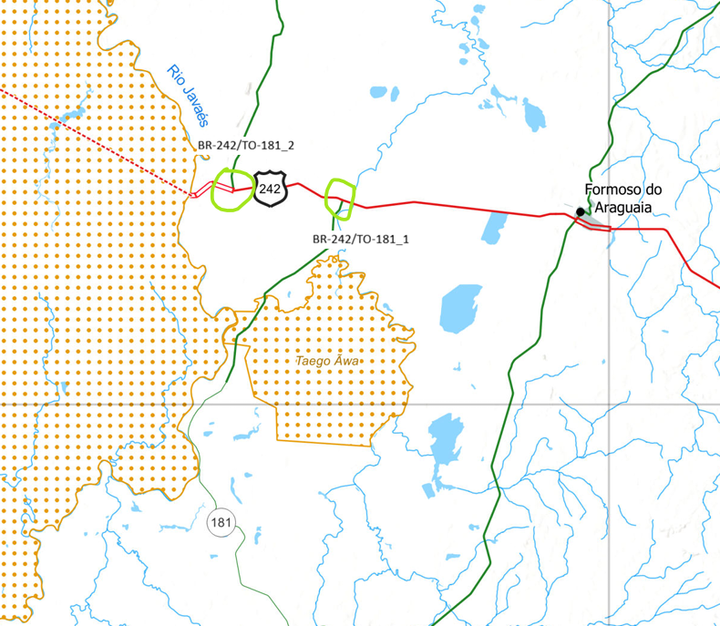
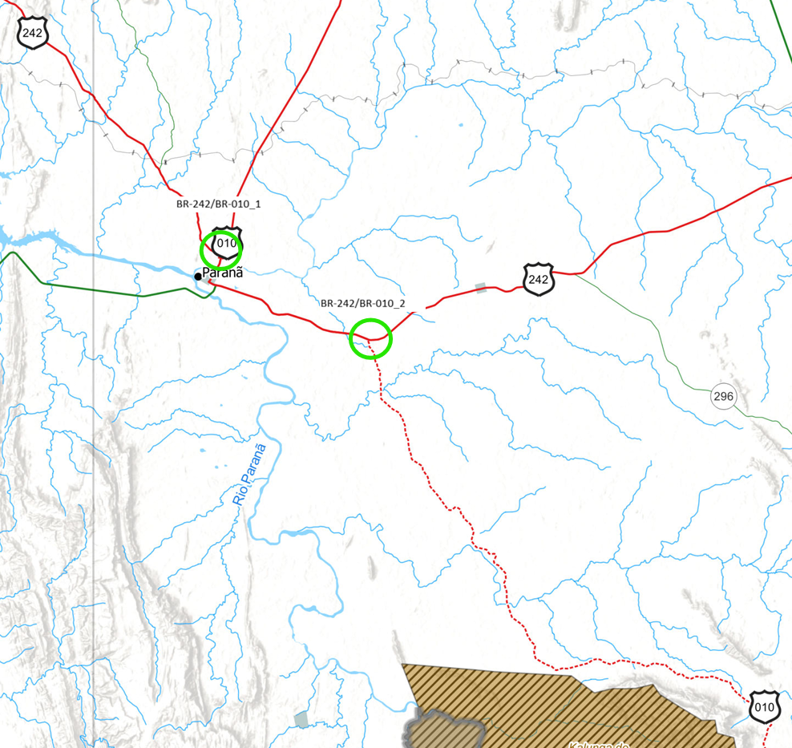
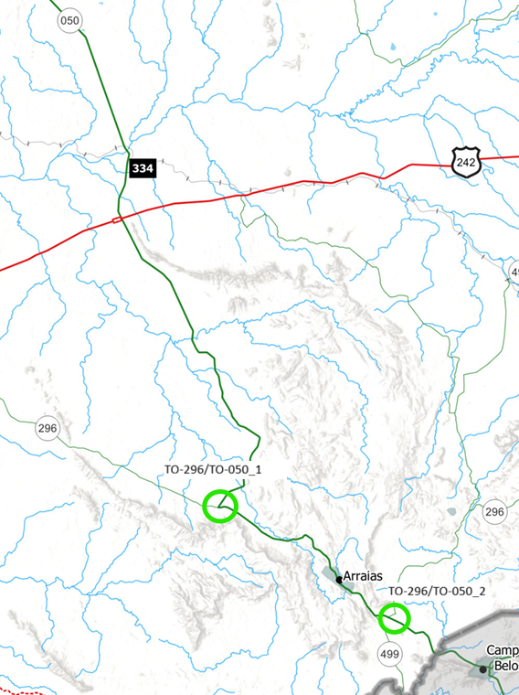

# Destino Boladão

Este é um trabalho bimestral proposto na disciplina Estrutura de Dados II, do curso Análise e Desenvolvimento de Sistemas do IFTO - *Campus* Araguaína.

# Conceito

A princípio, criar uma aplicação CLI utilizando Java que irá calcular qual é a melhor rota entre duas cidades da Região Metropolitana de Gurupi (instituída pela LEI COMPLEMENTAR Nº 172, DE 11 DE FEVEREIRO DE 2026) utilizando conceitos básicos de Grafos.

# Restrições

Não é permitido o uso de bibliotecas de grafos ou quaisquer outras estruturas de dados prontas para este fim. A única exceção é o uso de ArrayLists (Java).

# Integrantes

- Alexandre William
- Jackson Alves dos Santos
- Kamilly Silva
- Lidia Cruz de Araújo
- Paulo Ricardo Rodrigues Silva

# Arquitetura

A aplicação é composta por três camadas: CLI, Camada de Serviço e Camada de Dados.

## CLI

É a Interface do Usuário, que vai obter as entradas, validá-las e retornar os resultados para o usuário. Ela é consumida exclusivamente via terminal.

## Camada de Serviço

É a camada responsável por fazer o processamento das rotas solicitadas pelo usuário e retornar os resultados. O processamento é realizado com base no Grafo em memória.

## Camada de Dados

É a camada responsável por comunicar com a base de dados, em JSON. Ou seja, realizar todas as consultas necessárias para montar grafo em memória.

Não serão necessárias realizar inserções ou qualquer tipo de modificações, pois as informações serão estáticas, ao menos a princípio.

# Definições

## Fontes de dados

### Para trechos em concessão

> Só existem pedágios em trechos concedidos (privatizados).
> 

Para checagem de Postos da PRF, Pedágios, acessar em: [https://www.ecoviasaraguaia.com.br/condicoes-da-via](https://www.ecoviasaraguaia.com.br/condicoes-da-via)

Para checagem de trechos em obras, acessar em: [Duplicação da BR-153/GO/TO - EcoRodovias](https://www.ecoviasaraguaia.com.br/servicos/duplicacao-br-153-go-to)

### Lei Complementar nº 172

- Nome das cidades.

### Mapa Multimodal do Tocantins - DNIT

- Nome das Rodovias;
- Presença de Asfalto;
- Postos da PRF; e
- Tipo de via.

### Wase

- Distância entre cidades; e
- Presença de buracos.

### **Art. 61 da Lei nº 9.503 do Código de Trânsito Brasileiro**

- Limite de velocidade.

### Mapa de Manutenção Rodoviária

- Manutenção de Rodovias Federais (BRs).

### Portal de Notícias do AGETO

- Manutenção de Rodovias Estaduais (TOs).

### Pesquisa CNT de Rodovias

- Estado geral da rodovia.

## Entidades e atributos

| Cidade | Rodovia (segmento)                 |
|--------|------------------------------------|
| id     | id                                 |
| nome   | nome                               |
|        | condição geral                     |
|        | distância entre vértices (cidades) |
|        | presença de asfalto                |
|        | presença de buracos                |
|        | tipo de via (simples, dupla, etc.) |
|        | presença de pedágios               |
|        | está em obras                      |
|        | velocidade média permitida         |
|        | postos da prf                      |

## Utilização dos atributos

### Peso 1 (Distância entre os destinos)

- Distância entre vértices.

### Peso 2 (Tempo de viagem)

- Distância entre vértices;
- Presença de asfalto;
- Presença de buracos;
- Tipo de via
- Presença de Pedágios;
- Está em obras; e
- Velocidade média permitida.

### Peso 3 (Custo/Fatores de Risco)

- Condição geral.

## Exceções de nomenclatura das rodovias

Exceções nas nomenclaturas de via ocorreram pois em determinados casos há duas intersecções diferentes com as mesmas vias. A título de exemplo, a BR-242 abaixo, que tem duas intersecções com a TO-181 em dois vértices diferentes (não coincidentes).

Manter uma nomenclatura única para o caso acima causaria duplo entendimento até mesmo a nível de código, mesmo que com IDs separados. Portanto, fez-se necessária a nomenclatura no padrão *_n* onde *n* é um valor numérico da quantidade de intersecções das mesmas vias.

### BR-242/TO-181

### BR-242/BR-010

### TO-296/TO-050

# Tarefas

## Criação da Base de Dados

- [x]  Localizar e, quando possível, obter fontes de dados, para utilização do projeto, como mapas e informações retirados de plataformas de geolocalização. As informações necessárias são:
    - [x]  Nome das cidades;
    - [x]  Nome das rodovias;
    - [x]  Distância entre cidades;
    - [x]  Presença de asfalto;
    - [x]  Presença de buracos;
    - [x]  Tipo de via (simples ou dupla);
    - [x]  Presença de pedágios;
    - [x]  Presença de obras ou manutenções;
    - [x]  Limite de velocidade; e
    - [x]  Estado geral da rodovia.
- [x]  Transcrever todos os dados necessários para uma tabela no Google Planilhas.
    - [x]  Tabela de Adjacência;
    - [x]  Tabela de Incidência;
    
    ### Rodovias (Arestas)
    
    - [x]  Nome e Id das vias;
    - [x]  Nomes e Ids dos vértices (1 e 2);
    - [x]  Condição Geral;
    - [x]  Distância;
    - [x]  Pavimentação;
    - [x]  Buracos;
    - [x]  Pedágios;
    - [x]  Postos da PRF;
    - [x]  Em obras; e
    - [x]  Vel. Média permitida.
    
    ### Cidades (Vértices)
    
    - [x]  Id;
    - [x]  Nome dos vértices.
- [x]  Transformar a tabela do Planilhas em um arquivo JSON utilizando o notebook específico do Google Colab.
    - [x]  Rodovias (arestas)
    - [x]  Vértices
    - [x]  Tabela de Incidência
    - [x]  Tabela de Adjacência

## Camada de Dados

- [x]  Criar classe DataGetResult.
    - [x]  Criar atributos para armazenar os objetos Vertex, matrizes de incidência e matrizes de adjacência.
- [x]  Criar classe Data.
    - [x]  Fazer a classe retornar um objeto do tipo DataGetResult.
- [x]  Criar classe Vertex.

## Camada de Serviço

- [x]  Criar classe Graph.
    - [x]  Fazer a classe retornar um array de Vertex (vértices) na ordem crescente para a rota a ser seguida pelo usuário.
- [x]  Sobrecarregar o método calculateBestRoute para aceitar parâmetros de nomes de vértices, fazer o parsing dos nomes e executar o método em sua versão de IDs.

## CLI

- [x]  Criar comando clear, para limpar o terminal.
- [x]  Criar comando help.
- [x]  Criar classe RouteFormatter para formatar o resultado de uma rota.
    - [x]  Criar método para formatar e retornar uma saída de dados de acordo com o modelo.
    - [x]  Criar método para retornar um separador para a próxima saída de dados.
    - [x]  Criar método para inserir avisos (se há buracos e se está em obra) na saída.
- [x]  Criar comando route.
    - [x]  Incluir a possibilidade do usuário informar o nome ou id da cidade como primeiro e segundo parâmetros.
    - [x]  Organizar a saída do comando para que a rota esteja na ordem correta. Pois a ordem dos nomes dos vértices retornados pelo grafo não estão necessariamente na direção de deslocamento do usuário.
    - [x]  Incluir avisos ao formatador de saída conforme estiver em cada objeto Edge.
    - [x]  Incluir tratamento de erro para o caso de parâmetros inválidos, como nomes de cidades inexistentes.
        - [x]  Adicionar saída para o caso de não existir uma rota.
    - [x]  Informar ao usuário o tempo de viajem estimado.
- [x]  Resolver problema de rota de Dueré para Alvorada.
- [x]  Resolver problema do peso em relação ao pedágio, da rota mais rápida.
- [x]  Resolver problema de entrada, na qual não é possível inserir nomes de cidades com espaços.

# Extras

- [ ]  Criar comando para listar: rodovias e cidades.
    - [ ]  Rodovias
    - [ ]  Cidades
- [ ]  Fazer resumo da rota ao final.
- [ ]  Incluir as tarifas de pedágios para o índice de degradação (custo) para uso da via.
- [ ]  Criar formas de inserir, atualizar ou deletar cidades e rodovias.

# Dependências

- Picocli (Java) - Utilizada para melhor estruturação e apresentação dos comandos e resultados. (Site oficial: [picocli - a mighty tiny command line interface](https://picocli.info/))
- Shadow (Java) - Utilizada para gerar o fat JAR (Disponível em: [GradleUp/shadow: Gradle plugin to create fat/uber JARs](https://github.com/GradleUp/shadow))

# Referências e Fontes de Dados

- Mapa Multimodal do Tocantins - DNIT (Disponível em: [https://www.gov.br/dnit/pt-br/assuntos/planejamento-e-pesquisa/dnit-geo/mapas-multimodais/mapas-2025/to.pdf/](https://www.gov.br/dnit/pt-br/assuntos/planejamento-e-pesquisa/dnit-geo/mapas-multimodais/mapas-2025/to.pdf/))
- Lei Complementar Nº 172, de 11 de Fevereiro de 2026 (Disponível em: [lei_172-2026_79220.PDF](https://www.al.to.leg.br/arquivos/lei_172-2026_79220.PDF))
- Wase (Disponível em: [https://www.waze.com/](https://www.waze.com/))
- Google Maps (Disponível em: [Google Maps](https://www.google.com.br/maps))
- Pesquisa CNT de Rodovias (Disponível em: [Pesquisa CNT de Rodovias](https://pesquisarodovias.cnt.org.br/mapa))
- Mapa de Manutenção - DNIT (Disponível em: [https://www.gov.br/dnit/pt-br/rodovias/mapa-de-gerenciamento/mapas-de-manutencao-fevereiro-2026](https://www.gov.br/dnit/pt-br/rodovias/mapa-de-gerenciamento/mapas-de-manutencao-fevereiro-2026))
- Portal de Notícias AGETO (Disponível em: [Notícias - Agência de Transportes, Obras e Infraestrutura - AGETO-TO](https://www.to.gov.br/ageto/noticias/data/2026/))
- Ecovias Araguaia - Condições da Via (Disponível em: [https://www.ecoviasaraguaia.com.br/condicoes-da-via](https://www.ecoviasaraguaia.com.br/condicoes-da-via))
- Ecovias Araguaia - Duplicação da BR-153/TO/GO (Disponível em: [https://www.ecoviasaraguaia.com.br/servicos/duplicacao-br-153-go-to](https://www.ecoviasaraguaia.com.br/servicos/duplicacao-br-153-go-to))
- Art. 61 da Lei nº 9.503 do Código de Trânsito Brasileiro, de 23 de setembro de 1997 (Disponível em: [Art. 61 do Código de Trânsito Brasileiro - Lei 9503/97 | Jusbrasil](https://www.jusbrasil.com.br/topicos/10620236/artigo-61-da-lei-n-9503-de-23-de-setembro-de-1997))